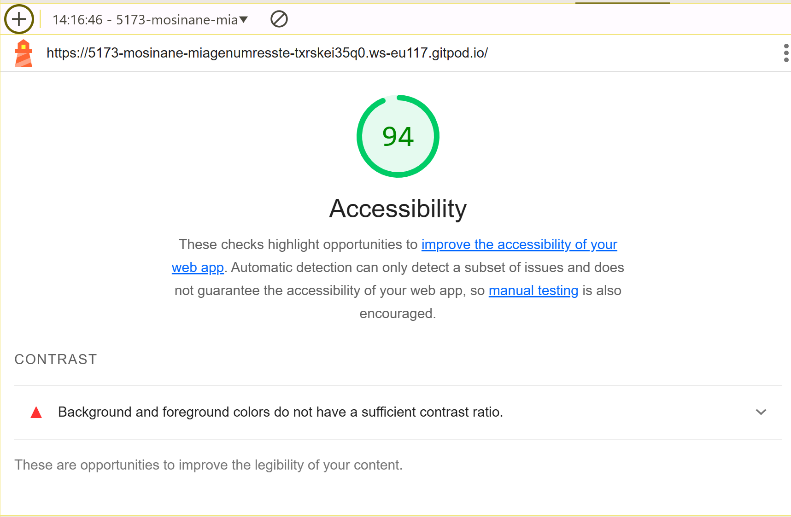

# Q1: Quels sont les arguments que vous pouvez utiliser pour convaincre votre Client de rendre son quizz accessible ? (Vous pouvez vous aider du cour)
Réponse:
1. Respect des lois et réglementations
Dans de nombreux pays, il existe des lois sur l'accessibilité numérique (comme le RGAA en France ou le WCAG à l'international).
Être en conformité avec ces réglementations évite des sanctions légales et des amendes.
2. Inclusion et égalité d'accès
Rendre un quiz accessible garantit que toutes les personnes, y compris celles ayant des handicaps (visuels, auditifs, moteurs ou cognitifs), peuvent y participer.
Cela montre un engagement envers l'égalité des chances et l'inclusion.
3. Meilleure expérience utilisateur pour tous
Les améliorations d'accessibilité (comme une meilleure navigation ou des contrastes optimisés) bénéficient à tous les utilisateurs, pas seulement à ceux ayant des besoins spécifiques.
Par exemple, les sous-titres pour les vidéos aident les personnes dans des environnements bruyants.
4. Amélioration de l'image de marque
Une entreprise ou organisation qui investit dans l'accessibilité est perçue comme responsable et socialement engagée.
Cela peut attirer davantage de clients ou d’utilisateurs sensibles à ces valeurs.
5. Augmentation de l'audience
Selon l’OMS, environ 15 % de la population mondiale vit avec un handicap.
Rendre un quiz accessible permet d'atteindre un public plus large et d’augmenter le nombre de participants.
6. SEO et visibilité
Les bonnes pratiques d'accessibilité (comme l'utilisation de balises alternatives pour les images ou une structure claire) améliorent également le référencement naturel sur les moteurs de recherche.
Un contenu bien structuré est plus facilement indexé.
7. Innovation et pérennité
Intégrer l'accessibilité dès le départ dans un projet montre une vision innovante et durable.
Cela réduit les coûts d’adaptation ultérieure si les besoins changent.
8. Avantage concurrentiel
Dans certains secteurs, peu d'entreprises investissent dans l'accessibilité. En rendant un quiz accessible, le client peut se démarquer de la concurrence.
9. Respect des valeurs humaines
En rendant un contenu accessible, le client s'aligne sur des valeurs éthiques et humaines, en mettant en avant l'importance de la diversité et de l’inclusion.

# Q2: Ajouter le screen de votre score :
Screen:

# Q3: Est-ce que l'analyse de Lighthouse est suffisante pour évaluer l'Accessibilité de votre Application ?
Réponse: Lighthouse est un excellent point de départ pour évaluer l'accessibilité, car il fournit des retours rapides et automatisés sur des problèmes courants comme les attributs alt manquants ou les contrastes de couleur insuffisants. Cependant, il n'est pas suffisant à lui seul, car il ne couvre pas toutes les exigences, notamment la navigation au clavier ou l'expérience utilisateur avec les technologies d'assistance. Pour garantir une accessibilité complète, Lighthouse doit être complété par des tests manuels, des retours d'utilisateurs en situation de handicap et des outils supplémentaires comme Axe ou Accessibility Insights pour une évaluation plus approfondie.

# Q4: Combien de fois vous devez utiliser une touche du clavier pour passer le quizz ?
Réponse: 33

# Q5: Donner 3 roles ARIA et 3 propriété ARIA
Réponse: Les rôles ARIA permettent de définir le comportement des éléments pour les technologies d’assistance, comme role="button" pour indiquer un bouton, role="alert" pour signaler des messages importants, et role="navigation" pour structurer une zone de navigation. Les propriétés ARIA enrichissent l’accessibilité des éléments, par exemple aria-label pour ajouter une description accessible, aria-hidden pour cacher un élément aux lecteurs d’écran, et aria-expanded pour indiquer si un élément interactif est déployé ou replié.

# Q6: Ajouter le screen de votre score Lighthouse
Screen: 

# Q7: L'une des best practice de l'ARIA est "ne pas utiliser l'ARIA" pouvez nous expliquer pourquoi d'après vous ?
Réponse:

# Q8: Ajouter le screen de votre score Lighthouse
Screen:

# Q9: Pourquoi le score de lighthouse n'a pas augmenté d'après vous ?
Réponse:

# Q10: Quel est la valeur du rapport de contraste actuel :
Réponse:

# Q11: Quel est la valeur du score AA :
Réponse:

# Q12: Quel est la valeur du score AAA :
Réponse:

# Q13: Comment pouvez vous changer la valeur du contraste de votre texte ?
Réponse:

# Q14: Ajouter le screen de votre score Lighthouse
Screen:

# Q15: Êtes vous capable de déterminer visuellement ce qui est un lien ou pas en appliquant chaque altérations ?
Réponse:

# Q16: Ajouter le screen de votre score Lighthouse
Screen:

# Q17:  Proposition 1
Description:
Nb d'actions gagnée : 

# Q18:  Proposition 2
Description:
Nb d'actions gagnée : 

# Q19:  Proposition 3
Description:
Nb d'actions gagnée : 
